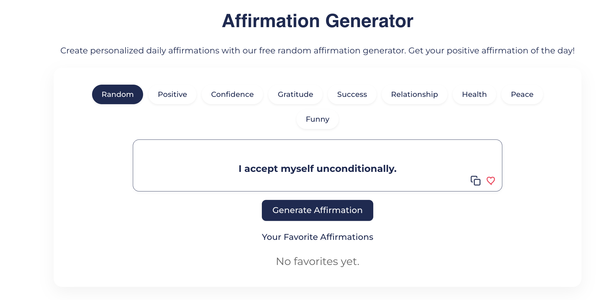
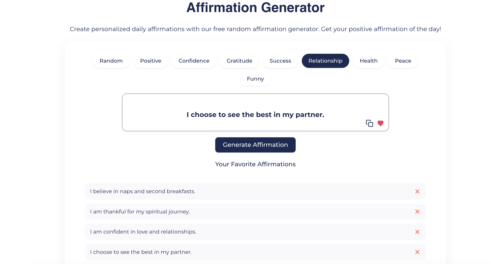

# **Affirmation Generator – Free Online Tool for Daily Positive Affirmations**

**AffirmationFlow’s Affirmation Generator** is a free online tool that instantly creates personalized affirmations for different categories like **positivity, confidence, gratitude, success, relationships, health, peace, and more**.  
It helps users find accurate, uplifting affirmations they can **copy, save, and revisit anytime**.

🔗 **Try the tool here:**  
https://affirmationflow.com/affirmation-generator/

## 📸 Screenshots

### 🏠 Affirmation Generator – Home Page

### 🎯 Category Selection

## ⭐ **What Is the Affirmation Generator?**

The **Affirmation Generator** is a simple and powerful tool that generates meaningful affirmations based on your emotional needs or goals. Whether you want motivation, self-love, clarity, or confidence, this tool instantly provides high-quality affirmations customized for your mindset.

Perfect for:

- Personal growth  
- Daily motivation  
- Journaling  
- Manifestation practice  
- Social media content  
- Meditation routines  
- Stress relief

## 🎯 **Key Features**

### **✨ 1. Multiple Affirmation Categories**
Generate affirmations in various categories:

- Positive Affirmations  
- Confidence Boost  
- Gratitude  
- Success & Career  
- Relationships  
- Health & Well-Being  
- Peace & Calm  
- Funny & Lighthearted  
- Random Affirmations  

### **✨ 2. Copy Any Affirmation Instantly**
Just click once to copy your favorite affirmation to your clipboard.

### **✨ 3. Save Your Favorites**
Users can save affirmations and access them anytime when they revisit the tool.

### **✨ 4. Clean & Distraction-Free Interface**
Minimal, calming design for a smooth affirmation experience.

### **✨ 5. 100% Free to Use**
No signup, no ads, no limitations — just pure affirmations.

## 💡 **Why Use This Affirmation Generator?**

- Helps you stay positive and focused  
- Reduces stress and overthinking  
- Boosts self-love, confidence, and clarity  
- Inspires discipline, gratitude, and peace  
- Great for manifestation and mindset shifting  
- Creates affirmations that feel personal and meaningful  

## 📌 **How It Works**

1. Choose a category  
2. Click “Generate Affirmation”  
3. Copy or save the affirmation  
4. Revisit anytime to see saved affirmations  
5. Generate unlimited new ones  

## 🧘 **Who Is This For?**

- Students  
- Entrepreneurs  
- Creators  
- Spiritual seekers  
- Manifestation lovers  
- People struggling with stress or negativity  
- Anyone who wants daily motivation  

## 🚀 **Visit the Affirmation Generator**

👉 **https://affirmationflow.com/affirmation-generator/**

Use it daily to improve your mindset and attract positive energy into your life.
